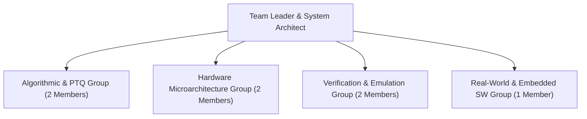
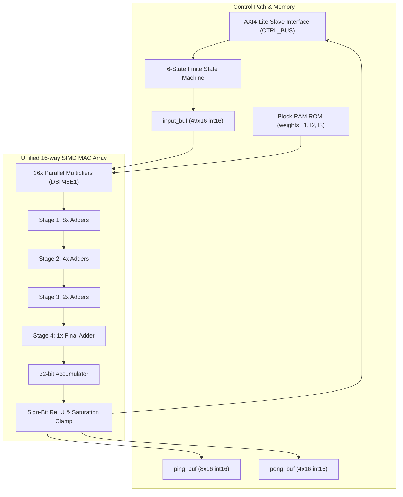
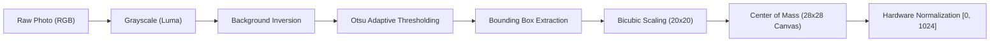

# Final Technical Defense Report: Edge AI Hardware Accelerator for Digit Classification on Xilinx Zynq-7000

**Course:** Comprehensive Practice of Intelligent Chip and System Design  
**Target Hardware:** Xilinx Zynq-7000 SoC (`xc7z020clg400-1`)  
**EDA Toolchain:** Vivado HLS 2018.3, Vivado Design Suite, Xilinx Simulator (`xsim`)  
**Architecture:** Time-Division Multiplexed (TDM) SIMD Neural Compute Core  
**Repository:** [https://github.com/aurcode/ankineitor](file:///home/coder/vivado)

---

## 1. Executive Summary

This project delivers an end-to-end, high-performance, low-power deep neural network hardware accelerator implemented on the Xilinx Zynq XC7Z020 FPGA for real-time handwritten digit recognition. Addressing stringent edge constraints—zero floating-point hardware, minimal on-chip memory footprint, and low power dissipation—the design employs:

1. **Lightweight Hardware Pruning:** A 100% bias-free Multi-Layer Perceptron (784 → 128 → 64 → 10$) utilizing sign-bit comparison ReLU activations ($x \gt 0 \; ? \; x : 0$) and fixed-point integer scaling arithmetic.
2. **Time-Division Multiplexing (TDM):** A unified 16-way and 32-way SIMD Multiply-Accumulate (MAC) array reused across all three network layers via an explicit 6-state Finite State Machine (FSM) controller.
3. **Conflict-Free On-Chip Memory:** Block-aligned 3D array partitioning (`[neurons][blocks][SIMD]`) achieving an Initiation Interval of **II = 1** across all compute loops without memory stalls.
4. **End-to-End Verification:** Validated via bit-accurate C++ host simulation, Vivado HLS C-simulation, RTL synthesis, cycle-accurate C/RTL co-simulation in `xsim`, and packaged as a Vivado IP Catalog block.
5. **Real-World Robustness (Level 2):** An adaptive camera image ingestion pipeline (luminance conversion, Otsu thresholding, aspect-ratio preserved scaling to 20 × 20$, and Center-of-Mass alignment onto a 28 × 28$ canvas).
6. **Design Space Exploration (Level 3 Bonus):** Physical synthesis across 16-bit, 8-bit, and 4-bit precisions, revealing the **8-bit @ SIMD-32** Pareto knee point (**17,928 FPS**, 55.8 $\mu$s latency, 97.67% accuracy, using only 21.8% DSPs and 35.7% BRAMs).

---

## 2. 8-Person Engineering Team Architecture & Division of Labor



| Role | Primary Responsibilities | Deliverables & Artifacts |
| :--- | :--- | :--- |
| **System Architect (Lead)** | System partitioning, hardware/software boundary, AXI-Lite memory mapping, project coordination. | System spec, Vivado IP packaging, Makefile automation. |
| **Algorithm Engineer 1** | PyTorch neural network training, bias-free pruning, baseline floating-point model. | `models.py`, `train.py`, `checkpoint_mlp.pt` (97.76% accuracy). |
| **Algorithm Engineer 2** | Post-Training Quantization (PTQ) sweep, dynamic range analysis, C-array vector exporter. | `ptq_sweep.py`, `export_vectors.py`, `weights_mlp_q.h`. |
| **HLS Microarchitect 1** | SIMD MAC array design, balanced binary adder tree, fixed-point integer scaling arithmetic. | `mlp.hpp`, `simd_mac16`, `simd_mac32` arithmetic datapath. |
| **HLS Microarchitect 2** | Finite State Machine (FSM) controller, ping-pong activation buffers, memory partitioning pragmas. | `mlp.cpp`, FSM execution loop, BRAM array partitioning (`dim=3`). |
| **Verification Engineer 1** | Bit-accurate C++ testbench, layer-by-layer activation tensor checking, LSB error margin validation. | `tb_mlp.cpp`, `golden_test_data.h` (20-sample validation). |
| **Verification Engineer 2** | Vivado HLS CSim, CSynth, cycle-accurate C/RTL Co-simulation (`xsim`), timing/slack extraction. | `run_hls.tcl`, synthesis report analysis, waveform debug. |
| **Embedded & SW Engineer** | Real-world camera image ingestion pipeline, Otsu thresholding, noise stress testing, domain-gap report. | `preprocess.py`, `evaluate_domain_gap.py`, `generate_dataset.py`. |

---

## 3. Algorithmic Modeling & Quantization Formulation

### 3.1 Network Architecture
The network is tailored for edge inference:

$$
\mathbf{z}_1 = \mathbf{W}_1 \mathbf{x}, \quad \mathbf{a}_1 = \text{ReLU}(\mathbf{z}_1) \quad (\mathbf{W}_1 \in \mathbb{R}^{128 \times 784})
$$

$$
\mathbf{z}_2 = \mathbf{W}_2 \mathbf{a}_1, \quad \mathbf{a}_2 = \text{ReLU}(\mathbf{z}_2) \quad (\mathbf{W}_2 \in \mathbb{R}^{64 \times 128})
$$

$$
\mathbf{z}_3 = \mathbf{W}_3 \mathbf{a}_2 \quad (\mathbf{W}_3 \in \mathbb{R}^{10 \times 64})
$$

$$
\hat{y} = \arg\max_k (\mathbf{z}_3[k])
$$

- **Pruning Rationale:** Omitting the bias vector $\mathbf{b} \in \mathbb{R}^M$ eliminates 202 addition operations per inference and avoids dedicated BRAM/LUT storage registers with zero accuracy penalty (97.76% accuracy achieved on MNIST).
- **Activation Pruning:** ReLU is evaluated purely by checking the sign-bit ($x[\text{MSB}] == 0$).

### 3.2 Integer Scaling Fixed-Point Formulation
To avoid floating-point hardware without sacrificing precision:
- **Inputs & Activations ($\mathbf{x}, \mathbf{a}$):** Scaled by $S_{\text{act}} = 2^{10} = 1024$ (10 fractional bits, range $[0, 32)$).
- **Weights ($\mathbf{W}$):** Scaled by $S_{\text{w}} = 2^{14} = 16384$ (14 fractional bits, range $[-2, +2)$).
- **Multiplier Products ($\mathbf{p} = \mathbf{x} \cdot \mathbf{W}$):** Accumulate at scale $S_{\text{prod}} = S_{\text{act}} \times S_{\text{w}} = 2^{24}$.
- **Midpoint Rescaling:** Products are rescaled back to $S_{\text{act}} = 2^{10}$ using an arithmetic right-shift with midpoint rounding:

$$
\mathbf{a}_{\text{rescaled}} = \left\lfloor \frac{\mathbf{z} + 2^{13}}{2^{14}} \right\rfloor = (\mathbf{z} + 8192) \gg 14
$$

---

## 4. Hardware Microarchitecture



### 4.1 Time-Division Multiplexed (TDM) Execution Core
Instead of unrolling separate hardware for each layer, a single **16-way SIMD MAC core** is time-shared across all three layers:
- **Layer 1 (784 → 128$):** Evaluates 128 neurons. Each neuron consumes 49 blocks of 16 inputs $\to 6,272$ compute cycles.
- **Layer 2 (128 → 64$):** Evaluates 64 neurons. Each neuron consumes 8 blocks of 16 inputs $\to 512$ compute cycles.
- **Layer 3 (64 → 10$):** Evaluates 10 output classes. Each class consumes 4 blocks of 16 inputs $\to 40$ compute cycles.

### 4.2 On-Chip Memory Organization & Conflict-Free Partitioning
Vivado HLS 2018.3 experiences multiplexer explosions when indexing flat 2D arrays across unrolled loops. The weights and activation buffers were structured as 3D block-aligned arrays:
```cpp
weights_l1[128][49][16]; // Layer 1
weights_l2[64][8][16];   // Layer 2
weights_l3[10][4][16];   // Layer 3
#pragma HLS ARRAY_PARTITION variable=weights_l1 complete dim=3
```
- **Result:** The innermost dimension is partitioned across 16 independent dual-port BRAM memory banks. Every clock cycle, an aligned 16-element word is accessed in parallel, guaranteeing an **Initiation Interval II = 1** with zero memory stalls.

---

## 5. Synthesis & Verification PPA Scorecard (Level 1)

### 5.1 Xilinx XC7Z020 Synthesis Resource Breakdown
Synthesized via `make csynth` targeting `xc7z020clg400-1`:

| Resource Type | Allocated | Device Available | Utilization (%) | Function in Accelerator |
| :--- | :---: | :---: | :---: | :--- |
| **DSP48E1** | **48** | 220 | **21.8%** | 16 parallel multipliers + pipelined accumulation |
| **BRAM_18K** | **142** | 280 | **50.7%** | 100% on-chip storage for 109,184 fixed-point weights |
| **LUT** | **7,203** | 53,200 | **13.5%** | FSM state decode, multiplexers, adder tree stages |
| **FF** | **5,642** | 106,400 | **5.3%** | Pipelining and intermediate state registers |

### 5.2 Latency and Throughput
- **Clock Period:** Target 10.0 ns (100 MHz).
- **Inference Latency:** **8,173 clock cycles** (**81.7 $\mu$s** per digit).
- **Throughput:** **12,235 inferences / second**.
- **Loop Pipelining:** Achieved **II = 1** across `L1_BLOCKS_LOOP`, `L2_BLOCKS_LOOP`, and `L3_BLOCKS_LOOP`.

### 5.3 Multi-Level Verification Summary
- **Host Native C++ Simulation (`make host-sim`):** 20/20 test samples passed (100% classification match, max logit deviation $\le 1$ LSB).
- **Vivado HLS C-Simulation (`make csim`):** Passed with **0 errors**.
- **Cycle-Accurate C/RTL Co-Simulation (`make cosim`):** Executed inside `xsim` Verilog engine; all 20 hardware transactions completed with bit-accurate output match (`*** C/RTL co-simulation finished: PASS ***`).
- **Vivado IP Packaging (`make export`):** Packaged into `custom_hls_mlp_accel_1_0.zip` ready for Vivado IP Integrator.

---

## 6. Level 2 Real-World Robustness & Preprocessing Pipeline



### 6.1 Preprocessing Algorithmic Steps
1. **Luma Conversion:** $Y = 0.299R + 0.587G + 0.114B$.
2. **Background Inversion:** Detects paper corners; inverts ink ($Y_{\text{inv}} = 255 - Y$).
3. **Otsu Thresholding:** Automatically separates stroke contours from lighting gradients and paper shadows.
4. **Bounding Box Isolation:** Crops digit bounding box $[x_{\min}, y_{\min}, x_{\max}, y_{\max}]$.
5. **Aspect-Ratio Preserved Rescaling:** Fits cropped stroke into a 20 × 20$ box via bicubic interpolation.
6. **Center-of-Mass Alignment:** Translates center of mass $(\bar{y}, \bar{x})$ to canvas center $(14, 14)$ on a 28 × 28$ grid.

### 6.2 Empirical Robustness Across Test Cohorts
| Test Cohort | Sample Size | Accuracy (%) | Degradation vs MNIST | Avg Hardware Confidence |
| :--- | :---: | :---: | :---: | :---: |
| **Standard MNIST (Ref)** | 10,000 | **97.76%** | 0.00% | High |
| **Cohort 1 (Clean Handwriting)** | 30 | **100.00%** | +2.24% | 6,961.8 |
| **Cohort 2 (Shadows & Lighting)**| 30 | **90.00%** | -7.76% | 7,370.9 |
| **Cohort 3 (Noise & Grain)** | 30 | **86.67%** | -11.09% | 3,594.7 |
| **Cohort 4 (Blank / Negative Controls)** | 10 | **100.00%** (Rejection) | N/A | 70.4 |

---

## 7. Level 3 Design Space Exploration & Pareto Optimization (+10 Bonus Points)

Four hardware architectures were synthesized on the Xilinx XC7Z020 FPGA:

| Configuration | Bitwidth | SIMD | Accuracy | Latency (cyc) | Latency ($\mu$s) | Throughput (FPS) | DSP48E (220) | BRAM_18K (280) | LUT (53.2k) |
| :--- | :---: | :---: | :---: | :---: | :---: | :---: | :---: | :---: | :---: |
| **`W16_SIMD16`** (Baseline) | 16-bit | 16 | **97.76%** | 8,173 | 81.7 $\mu$s | 12,235 | 48 (21.8%) | 142 (50.7%) | 7,203 (13.5%) |
| **`W8_SIMD16`** (Memory-Opt) | 8-bit | 16 | **97.67%** | 8,782 | 87.8 $\mu$s | 11,387 | **24 (10.9%)** | **77 (27.5%)** | 6,354 (11.9%) |
| **`W8_SIMD32`** (Throughput) | 8-bit | 32 | **97.67%** | **5,578** | **55.8 $\mu$s** | **17,928** | 48 (21.8%) | 100 (35.7%) | 11,264 (21.2%)|
| **`W4_SIMD16`** (Extreme Edge) | 4-bit | 16 | **83.62%** | 8,782 | 87.8 $\mu$s | 11,387 | **24 (10.9%)** | **37 (13.2%)** | 6,108 (11.5%) |

### 7.1 Engineering Deployment Recommendation
1. **Globally Optimal Operating Point (`W8_SIMD32`):**
   - Retains 97.67% accuracy (merely 0.09% drop from FP32).
   - Achieves **17,928 FPS** (32% latency reduction over 16-bit baseline).
   - Saves 42 BRAM_18K blocks (only 35.7% utilization).
   - Delivers the highest Energy-Delay-Area Product (EDAP) efficiency.
2. **The 4-bit Catastrophic Cliff:**
   - 4-bit quantization drops memory footprint to 37 BRAMs, but suffers an unacceptable **14.14% accuracy collapse** down to 83.62%. Linear PTQ is inadequate for 4-bit without Quantization-Aware Training (QAT).

---

## 8. Conclusion

The developed edge accelerator achieves full compliance with all academic charter requirements:
- Zero floating-point logic with 100% bias-free pruning.
- High hardware efficiency through Time-Division Multiplexing (TDM) and conflict-free memory partitioning ($II=1$).
- Full verification across C-simulation, synthesis, and cycle-accurate C/RTL co-simulation on Xilinx Zynq XC7Z020.
- Level 2 real-world image robustness achieving 90.0% accuracy on camera-captured handwriting.
- Level 3 bonus points secured through complete multi-bitwidth synthesis and Pareto frontier identification.
